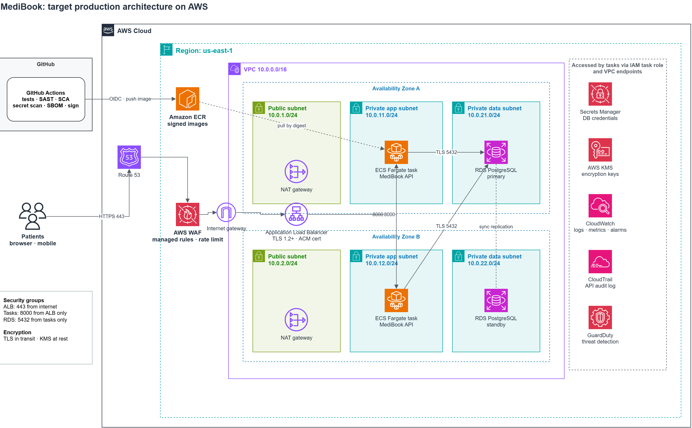

# MediBook

Appointment booking API for outpatient clinics. Patients create an account, browse open appointment slots, book a visit and view their own bookings.

The current release provides the patient booking API. Staff tools and an AI-assisted intake flow are planned for future releases.

> **Data notice:** this environment runs on synthetic data only. It holds no real patient information and is not intended for clinical use.

## Patient workflow

1. Create a patient account.
2. Sign in to receive an access token.
3. Browse open appointment slots.
4. Book a slot.
5. View the appointments linked to your account.

## Features

- Patient registration, sign-in and sign-out
- Server-side sessions with an 8-hour expiry and immediate revocation on sign-out
- Open appointment slots across clinics, ordered by time
- Booking with database-enforced protection against double booking
- Patient-specific appointment list
- Strict request validation and consistent HTTP errors
- Health endpoint and interactive API documentation at `/docs`

## Architecture



Target production architecture on AWS. Edit `diagrams/architecture.drawio.png` in VS Code with the Draw.io Integration extension, or at [app.diagrams.net](https://app.diagrams.net).

| Layer | Design |
| --- | --- |
| Edge | Route 53 DNS, AWS WAF (managed rules, rate limiting), Application Load Balancer terminating TLS 1.2+ |
| Compute | ECS Fargate tasks in private subnets across two Availability Zones; non-root containers with read-only filesystems |
| Data | Amazon RDS PostgreSQL, Multi-AZ, KMS-encrypted, automated backups; reachable only from the app tier |
| Secrets | Database credentials in Secrets Manager, read through the task IAM role |
| Delivery | GitHub Actions runs tests and security scans, signs the image, pushes to ECR through OIDC (no long-lived AWS keys) and deploys by image digest |
| Operations | CloudWatch logs, metrics and alarms; CloudTrail and GuardDuty for audit and threat detection |

The current release runs locally with SQLite. Containerisation and AWS deployment are on the [roadmap](#roadmap).

### Application stack

| Component | Technology | Responsibility |
| --- | --- | --- |
| API | Python 3.14, FastAPI, Uvicorn | HTTP routes, authentication dependency, booking operations |
| Validation | Pydantic | Request types, field constraints, rejection of unexpected fields |
| Data store | SQLite | Patients, sessions, slots and appointments |
| Password hashing | argon2id (`argon2-cffi`) | Memory-hard hashing with a per-password salt |
| Sessions | Opaque bearer tokens | Random 256-bit tokens; only a SHA-256 digest is stored |
| Tests | pytest, FastAPI TestClient | Isolated database per test |

See the [product brief](docs/brief.md) for users, protected data and scope.

## Getting started

**Prerequisites:** Git and Python 3.14 with `venv`. Commands target Ubuntu or Ubuntu on WSL2.

```bash
# Clone the repository
git clone https://github.com/abdurahim50/medibook.git
cd medibook

# Create and activate a virtual environment
python3 -m venv .venv
source .venv/bin/activate

# Install pinned application and test dependencies
python -m pip install -r requirements-dev.txt

# Create the database and load demo accounts and slots
python -m app.seed

# Start the API on localhost:8000
python -m uvicorn app.main:app --host 127.0.0.1 --port 8000
```

The seed command creates two demo patients and ten open slots across two clinics. Unless `MEDIBOOK_SEED_PASSWORD` is set, it generates a shared demo password and prints it once.

| Demo account |
| --- |
| `alex.rivera@example.com` |
| `sam.taylor@example.com` |

**Verify the service** from another terminal:

```bash
curl -sS http://127.0.0.1:8000/health
# {"status":"ok"}
```

**Try the API** at <http://127.0.0.1:8000/docs>: call `POST /auth/signin`, copy the `access_token`, then click **Authorize** and paste it to use protected endpoints.

Stop the server with `Ctrl+C`.

## API reference

Protected endpoints require `Authorization: Bearer <access_token>`.

| Method | Path | Description | Auth | Success |
| --- | --- | --- | --- | --- |
| `GET` | `/health` | API and database connectivity | None | `200` |
| `POST` | `/auth/signup` | Register a patient | None | `201` |
| `POST` | `/auth/signin` | Sign in and receive a session token | None | `200` |
| `POST` | `/auth/signout` | Revoke the current session | Required | `204` |
| `GET` | `/slots` | List open appointment slots | Required | `200` |
| `POST` | `/appointments` | Book a slot | Required | `201` |
| `GET` | `/appointments` | List the signed-in patient's appointments | Required | `200` |
| `GET` | `/appointments/{appointment_id}` | Get one appointment (see [known issues](#known-limitations)) | Required | `200` |

**Booking request:**

```json
{ "slot_id": 1 }
```

`slot_id` must be a positive integer. Patient identity always comes from the session; unknown fields, including a client-supplied `patient_id`, are rejected.

**Errors:** `401` invalid or missing authentication, `404` record not found, `409` email already registered or slot already booked, `422` invalid request data.

## Configuration

| Variable | Default | Description |
| --- | --- | --- |
| `MEDIBOOK_DB` | `medibook.db` | Path to the SQLite database file |
| `MEDIBOOK_SEED_PASSWORD` | Generated at seed time | Password assigned to the demo accounts |

Set these in your shell before running the seed command or server (for example `export MEDIBOOK_DB=/tmp/medibook.db`). The application does not load `.env` files automatically; `.env.example` lists every supported variable. Never commit a `.env` file.

### Resetting the development database

Seeding a database that already has slots leaves it unchanged. To rebuild a disposable development database, stop the server, then run:

```bash
python -m app.seed --reset
```

This permanently deletes all accounts, sessions and bookings in that database.

## Testing

```bash
python -m pytest -q
```

Each test runs against its own temporary SQLite database. The suite covers registration, authentication, sign-out, booking, patient-specific lists, double booking and input validation.

## Project structure

```
app/
  main.py      API routes and session dependency
  auth.py      password hashing and session management
  db.py        database connection and schema
  models.py    request and response models
  seed.py      demo data loader
tests/
  test_api.py  API test suite
docs/
  brief.md     product brief: users, data and assets
  evidence.md  delivery evidence by milestone
diagrams/
  architecture.drawio.png   editable architecture diagram
SECURITY.md    security controls, known issues, reporting
```

## Known limitations

- **MB-001:** `GET /appointments/{appointment_id}` authenticates the caller but does not yet enforce ownership, so a signed-in patient can read another patient's appointment by ID. This must be fixed before any shared or production deployment. Tracked in [SECURITY.md](SECURITY.md).
- API only; no patient web interface yet.
- Staff and admin workflows, cancellation, rescheduling, payments and AI intake are not implemented.
- Containerisation, CI/CD and cloud deployment are planned.

## Security

See [SECURITY.md](SECURITY.md) for the security model, known issues and how to report a vulnerability.

## Roadmap

- [x] Booking API with authentication and validation
- [ ] Appointment ownership enforcement on single-record lookups
- [ ] CI pipeline with automated tests and security scanning
- [ ] Container image and AWS deployment
- [ ] Logging, alerting and recovery runbook
- [ ] Clinic staff portal
- [ ] AI-assisted patient intake