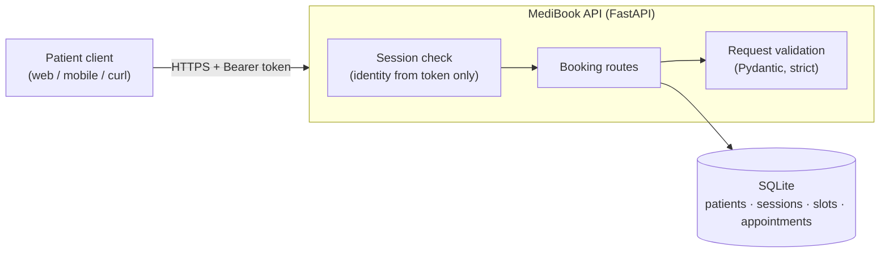

# MediBook

Appointment booking API for outpatient clinics. Patients create an account, browse open appointment slots, book a visit and manage their own bookings.

> **Data notice:** this environment runs on synthetic data only. It holds no real patient information and is not intended for clinical use.

## Features

- Patient registration, sign-in and sign-out
- Browse available appointment slots across clinics
- Book a slot, with double booking prevented at the database level
- View your own appointments
- Health endpoint for monitoring
- Interactive API documentation at `/docs`

## Architecture



| Component | Technology | Purpose |
| --- | --- | --- |
| API | Python 3.14, FastAPI | Routing, request validation, OpenAPI docs |
| Data store | SQLite | Patients, sessions, slots and appointments |
| Password hashing | argon2id (`argon2-cffi`) | Memory-hard hashing with per-password salt |
| Sessions | Server-side, opaque tokens | Revocable on sign-out; only a SHA-256 digest is stored |
| Tests | pytest, FastAPI TestClient | Isolated database per test |

## API

All endpoints except `/health`, `/auth/signup` and `/auth/signin` require `Authorization: Bearer <token>`.

| Method | Path | Description | Success |
| --- | --- | --- | --- |
| `GET` | `/health` | Service and database health | `200` |
| `POST` | `/auth/signup` | Register a patient | `201` |
| `POST` | `/auth/signin` | Sign in and receive a session token | `200` |
| `POST` | `/auth/signout` | Revoke the current session | `204` |
| `GET` | `/slots` | List open appointment slots | `200` |
| `POST` | `/appointments` | Book a slot (`{"slot_id": 1}`) | `201` |
| `GET` | `/appointments` | List the signed-in patient's appointments | `200` |
| `GET` | `/appointments/{id}` | Get one appointment | `200` |

Error responses: `401` not authenticated, `404` not found, `409` conflict (email taken or slot already booked), `422` invalid input.

## Getting started

**Prerequisites:** Linux or WSL2, Git, Python 3.14

```bash
git clone https://github.com/abdurahim50/medibook.git
cd medibook
python3 -m venv .venv && source .venv/bin/activate
python -m pip install -r requirements-dev.txt
python -m app.seed
python -m uvicorn app.main:app --host 127.0.0.1 --port 8000
```

- Health check: <http://127.0.0.1:8000/health>
- API docs: <http://127.0.0.1:8000/docs>

The seed script creates two clinics with open slots and two demo patients (`alex.rivera@example.com`, `sam.taylor@example.com`). It prints a random demo password once; set `MEDIBOOK_SEED_PASSWORD` to choose your own. Run `python -m app.seed --reset` to rebuild the local database.

### Configuration

| Variable | Default | Description |
| --- | --- | --- |
| `MEDIBOOK_DB` | `medibook.db` | Path to the SQLite database file |
| `MEDIBOOK_SEED_PASSWORD` | random | Password assigned to demo patients by the seed script |

Set these as environment variables (for example `export MEDIBOOK_DB=/tmp/medibook.db`). `.env.example` lists every supported variable. Never commit a `.env` file.

## Testing

```bash
python -m pytest -v
```

Each test runs against its own temporary database. The suite covers authentication, the booking journey, double booking and input validation.

## Project structure

```
app/
  main.py      API routes and the session dependency
  auth.py      password hashing and session management
  db.py        database connection and schema
  models.py    request and response models
  seed.py      synthetic data loader
tests/
  test_api.py  API test suite
docs/
  brief.md     product brief: users, data and assets
  evidence.md  delivery evidence by milestone
SECURITY.md    security controls and known issues
```

## Security

See [SECURITY.md](SECURITY.md) for the security model, known issues and how to report a vulnerability.

## Roadmap

- [x] Booking API with authentication and validation
- [ ] Appointment ownership enforcement on single-record lookups
- [ ] CI pipeline with automated tests and security scanning
- [ ] Container image and AWS deployment
- [ ] Logging, alerting and recovery runbook
- [ ] Clinic staff portal
- [ ] AI-assisted patient intake
