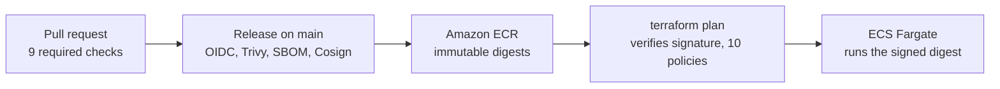
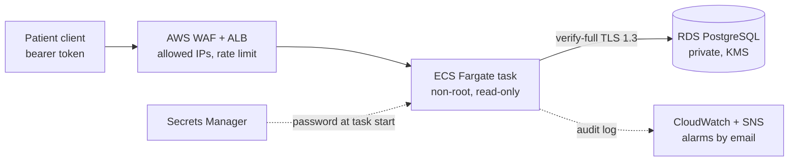

# Architecture walkthrough

Only images signed by the release workflow on `main` reach production, and only the API can reach the patient data. This page explains how, in the order a request and a release travel.

The diagram shows the target production design. The dev environment is a cost-reduced slice of it: see the differences at the end.

## Delivery path

1. **Pull request.** Nine checks must pass before a merge: tests against PostgreSQL, SAST (Bandit, Semgrep), dependency audit (pip-audit), secret scan over full history (Gitleaks), image scan (Trivy), policy tests (Conftest), an authenticated OWASP ZAP scan, a Terraform plan of both stacks with policy checks, and DCO sign-off.
2. **Release.** A merge to `main` runs [`release.yml`](../.github/workflows/release.yml): short-lived AWS credentials through GitHub OIDC (no stored keys), a Trivy gate, a push to ECR by digest, a CycloneDX SBOM, and a Cosign keyless signature and SBOM attestation recorded in the public Sigstore log.
3. **Plan and apply.** `terraform plan` runs [`verify-image-terraform.sh`](../scripts/verify-image-terraform.sh) as an external data source; the task definition has a precondition on its result, and [MB-POL-09](../policy/terraform/supply_chain.rego) requires image digests and the verification step. An unsigned image fails the plan before anything changes. Ten [policy rules](../policy/terraform/) check the plan before apply.

## Request path

| Hop | Accepts traffic only from | Protection |
| --- | --- | --- |
| Load balancer | Allowed client IPs | AWS WAF: sign-in rate limit, known-bad inputs; invalid headers dropped |
| API task | The load balancer's security group | Non-root, read-only root filesystem, all capabilities dropped, no task role |
| Database | The API task's security group | Private subnets with no internet route, KMS encryption, `rds.force_ssl=1`, 7-day point-in-time recovery |

The application checks every request's session and scopes every appointment query to the signed-in patient; another patient's record returns `404`. The database password is generated by RDS, kept in Secrets Manager and injected by ECS, so it never appears in code, plan, state or image. Security events go to a structured audit log; two alarms (denied requests, no healthy targets) email through a KMS-encrypted SNS topic.

## Dev environment versus production

| | Dev (this repository) | Production target |
| --- | --- | --- |
| Client to load balancer | HTTP, restricted to allowed IPs | HTTPS with an ACM certificate, no plain HTTP |
| API tasks | Public subnets, inbound only from the load balancer | Private subnets with VPC endpoints |
| Database | Single-AZ, deleted with the environment | Multi-AZ, deletion protection, final snapshot |
| Deploys | `terraform apply` from a workstation, signature verified in the plan | Deploys from CI only |
| Logs | 7-day retention in the same account | Longer retention in a separate, write-protected account |

Open gaps and their status are in [docs/controls.md](controls.md); the evidence for each claim on this page is indexed in [docs/evidence.md](evidence.md).
