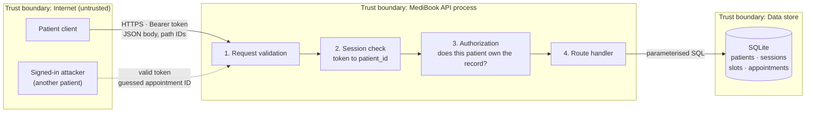

# MediBook threat model

Scope: the patient booking API (`app/`), its SQLite data store and the client that calls it. Method: data flow diagram with trust boundaries, then STRIDE per element.

## Data flow



Every request crosses the Internet boundary, so everything in it is untrusted: the body, the path parameters (such as `{appointment_id}`) and the token. Authentication (step 2) answers **who is calling**. Authorization (step 3) answers **what that caller may touch**. They are separate controls.

## Assets

| Asset | Impact if compromised |
| --- | --- |
| Appointment records | Reveals who receives care, where and when |
| Patient profiles | Exposes account identity; corrupts patient-to-record links |
| Credentials and sessions | Lets an attacker act as a patient |

## STRIDE analysis

| ID | Category | Threat | Element | Control | Status |
| --- | --- | --- | --- | --- | --- |
| TM-01 | Information disclosure | A signed-in patient reads another patient's appointment by changing the ID in `GET /appointments/{id}` (broken object-level authorization, OWASP API1) | Authorization | Ownership check scoped to the session's `patient_id` | **Mitigated (MB-001 fixed)** |
| TM-02 | Spoofing | Stolen or replayed session token | Session check | Random 256-bit tokens, hashed at rest, 8-hour expiry, revoked on sign-out | Mitigated |
| TM-03 | Spoofing | Online password guessing or credential stuffing against `/auth/signin` | Session check | Failed sign-ins throttled per account (5) and per client (20) in a 15-minute window; `429` with `Retry-After`; argon2id slows offline cracking | **Mitigated (MB-002)** |
| TM-04 | Information disclosure | Account enumeration through sign-in errors | Session check | Identical `401` for unknown email and wrong password | Mitigated |
| TM-05 | Tampering | Client books on behalf of another patient by sending `patient_id` | Request validation | Unknown fields rejected; identity only from the session | Mitigated |
| TM-06 | Tampering | SQL injection through body or path values | Route handler | Parameterised queries only | Mitigated |
| TM-07 | Tampering | Two patients book the same slot concurrently | Data store | `UNIQUE(slot_id)` enforced by the database | Mitigated |
| TM-08 | Information disclosure | Password hash or token leaked in API responses | Route handler | Response models exclude secret fields | Mitigated |
| TM-09 | Repudiation | No record of who accessed or changed which appointment | Route handler | Structured JSON audit log of sign-in, booking and appointment access, with request ID and client address; cross-patient attempts logged as `denied` | **Mitigated (MB-003)** |
| TM-10 | Denial of service | Oversized request bodies or request floods | Request validation, edge | Field length limits; AWS WAF rate limit on sign-in (100 per IP per 5 minutes) and AWS known-bad-inputs rules | Partially mitigated |
| TM-11 | Elevation of privilege | Vulnerable package in the container image, or a compromised API process taking over the host | Runtime | Non-root user, read-only root filesystem, all Linux capabilities dropped, pip removed from the image, image scanned in CI | Mitigated |
| TM-12 | Tampering | A modified or substituted image is deployed, or stolen CI credentials are used to push one | Delivery pipeline | Images published only by the release workflow on `main` through short-lived OIDC credentials; role trusts this repository by immutable ID; immutable ECR tags; keyless signature and SBOM attestation verified by signer identity in every Terraform deployment plan; digests required (MB-POL-09) | Mostly mitigated (changes made directly through the AWS API bypass Terraform) |
| TM-13 | Information disclosure | Patient data read directly from the database: exposed endpoint, stolen credentials, intercepted connection or copied storage | Data store | RDS in private subnets with no internet route; only the API tasks' security group can connect; TLS required (`rds.force_ssl`) and verified by the client (`verify-full`); password generated by RDS in Secrets Manager, readable only by the task execution role; storage, backups and secret encrypted with a customer-managed KMS key; enforced by MB-POL-10 | Mitigated (the application uses the database admin user; a separate least-privilege role is planned) |

## Selected threat: TM-01

**Why this one first:** it exposes the highest-ranked asset (appointment data), needs only an ordinary patient account and is trivial to exploit by counting IDs.

**Reproduction (synthetic accounts):**

1. Alex signs in and books a slot; the appointment gets ID `1`.
2. Sam signs in with his own valid token.
3. Sam requests `GET /appointments/1`.
4. **Expected:** `404 Not Found`. **Before fix:** `200 OK` with Alex's appointment. **After fix:** `404 Not Found`.

The regression test `test_patient_cannot_read_another_patients_appointment` in `tests/test_api.py` automates these steps.

## Control

The appointment lookup now filters by both the appointment ID and the patient ID taken from the session:

```sql
SELECT ... FROM appointments a JOIN slots s ON s.id = a.slot_id
WHERE a.id = ? AND a.patient_id = ?
```

The control sits at the **API process trust boundary**, step 3 in the data flow. The client cannot influence `patient_id`: it comes from the server-side session, and request bodies with a `patient_id` field are rejected. A record owned by someone else is indistinguishable from a missing record (`404`), so the response does not confirm that an ID exists.

## Remaining limitations

- **Per-query enforcement.** Ownership is enforced in each query rather than in one shared layer. Every new endpoint that reads patient data must include the same filter and a cross-patient test.
- **Predictable IDs.** Appointment IDs are sequential integers. They no longer expose data, but they reveal roughly how many bookings exist.
- **Audit log is local to each container (TM-09).** Events go to standard output. Retention, alerting and tamper resistance depend on the log platform (CloudWatch, planned).
- **Per-container rate limits (TM-03).** Counters are held in memory, so each container counts separately. A WAF rate-based rule at the edge is the shared control. An attacker can trigger a temporary throttle on another patient's account; it is not a permanent lockout.
- **Single role.** Clinic staff will need access to their clinic's appointments; that requires role-based rules beyond patient ownership.
